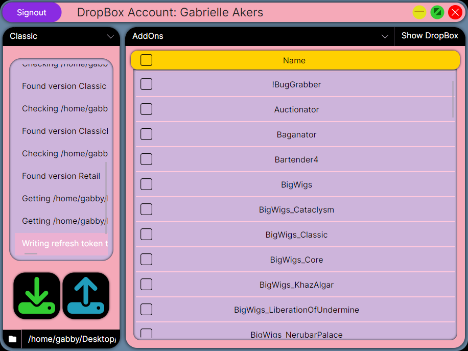

# wow-addon-backup

[Click here to download the latest release](https://github.com/GabrielleAkers/wow-addon-backuper/releases/latest)

easily backup your wow addons and settings to DropBox :)

just make a free DropBox account and the app will handle the rest

no fees, no ads, it just works

## Why?

curse and wago dont always see addons the other one downloaded so I needed a tool to easily backup ALL addons and settings

also i wanted to play around with a new UI framework so I built it with avalonia

## Building

if you want to build it yourself you need dotnet 9.0

then clone this repository and run `dotnet restore` to install dependencies

now run `dotnet publish -r linux-x64 -c Release` for linux or `dotnet publish -r win-x64 -c Release` for windows
